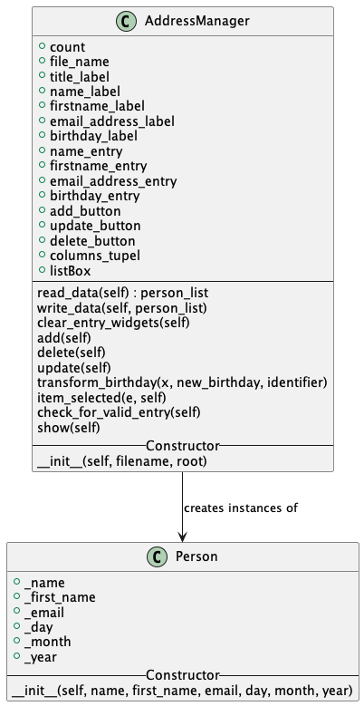

# python_course2022_task
**The repository can be found on GitHub ([here](https://github.com/nicoschurig/python_course2022_task))**    
This task is referring to the _**Python_Course for engineers and natural scientists**_ of the TU Bergakademie Freiberg.  

## Object Oriented Programming
The goal is to write a simple GUI-Application, which implements an object oriented address-management.  

## Process
#### 1 - Getting Started
- in order to get to realize a GUI-application in Python it is mandatory to learn something about a python GUI framework
- the framework used by me to create the application is called [_Tkinter_](https://docs.python.org/3/library/tkinter.html), which is the standard Python interface to the Tcl/Tk GUI toolkit
- I've worked with a [Video](https://www.youtube.com/watch?v=oWrJD74KixA) from the [_Programmieren Starten_](https://www.youtube.com/@ProgrammierenStarten) Youtube Channel to get to know the basic functionalities

#### 2 - Implementing Example Project
- after getting to know the Tkinter framework I implemented a small translation GUI-application, to test the acquired knowledge

#### 3 - Implementing the task
- with the new knowledge of Tkinter in combination with the knowledge from the _Python Course_ at the university, I was able to implement the required address-management GUI-application
- the following UML-Diagram was used to create the code for the application:

  

## Results
- the program is currently working in the way required
- still there need to be more changes made in order to realize a reliable Address Management System (especially to make it less error prone)
